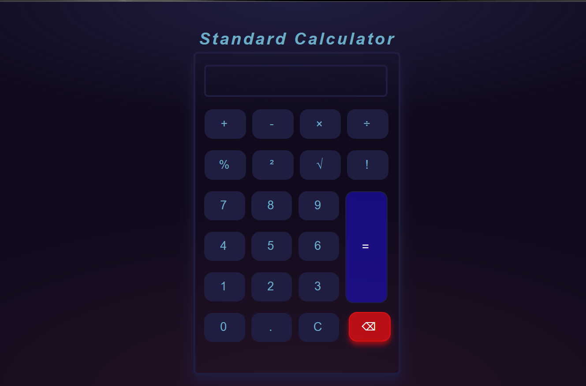

# Standard Calculator
Standard Calculator is a simple calculator designed using javascript to perform some basic arithmetic operation required during calculation. 

## Features :
Following fetures or operations we can perform using this calculator are :
<ul>
    <li>Addition</li>
    <li>Subtraction</li>
    <li>Multiplication</li>
    <li>Division</li>
    <li>Percentage</li>
    <li>Square Root</li>
    <li>Square Off</li>
    <li>Factorial</li>
    <li>Clear Screen</li>
    <li>Backspace</li>
</ul>

## Build With :
<ul>
    <li><a href="https://www.w3schools.com/html/" target="_blank">HTML</a></li>
    <li><a href="https://www.w3schools.com/css/" target="_blank">CSS</a></li>
    <li><a href="https://www.w3schools.com/js/" target="_blank">JavaScript</a></li>
</ul>

## Install and Run :

<ol>
    <li>Download the code and extract the zip file.</li>
    <li>Open the folder and double on the file named as <i>"index.html"</i> .</li>
</ol>

## Screenshot :

  
 